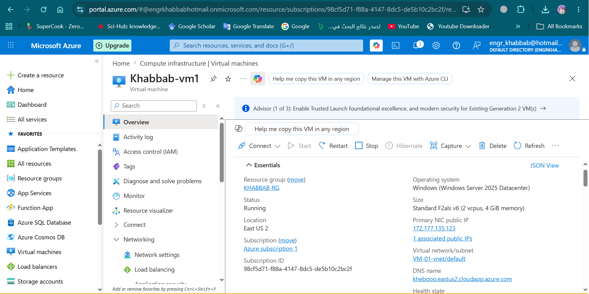
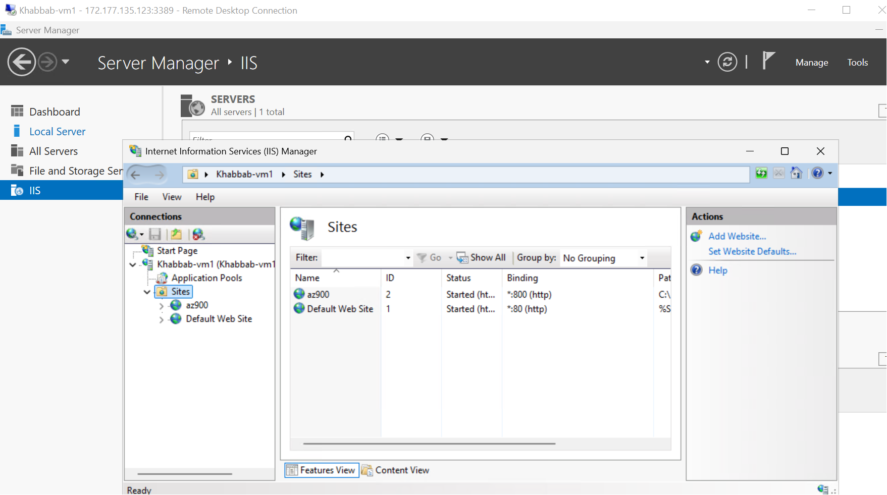
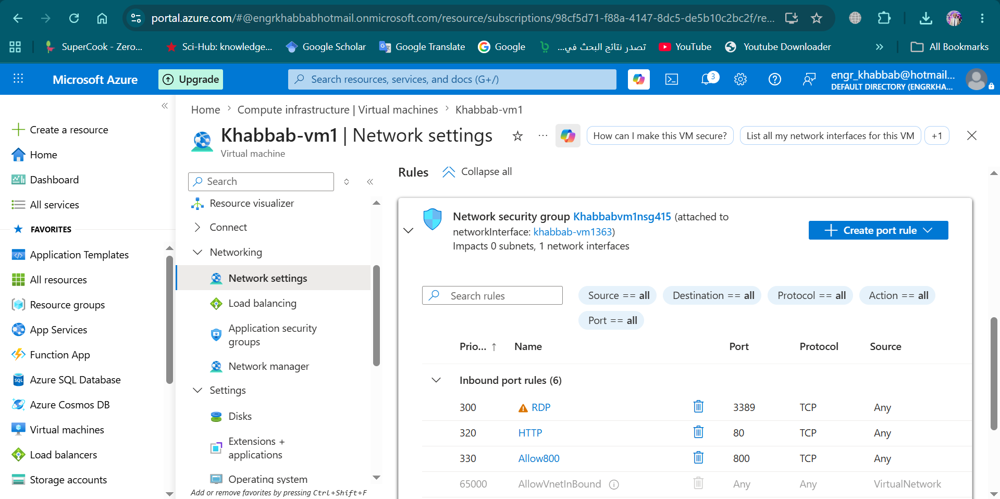
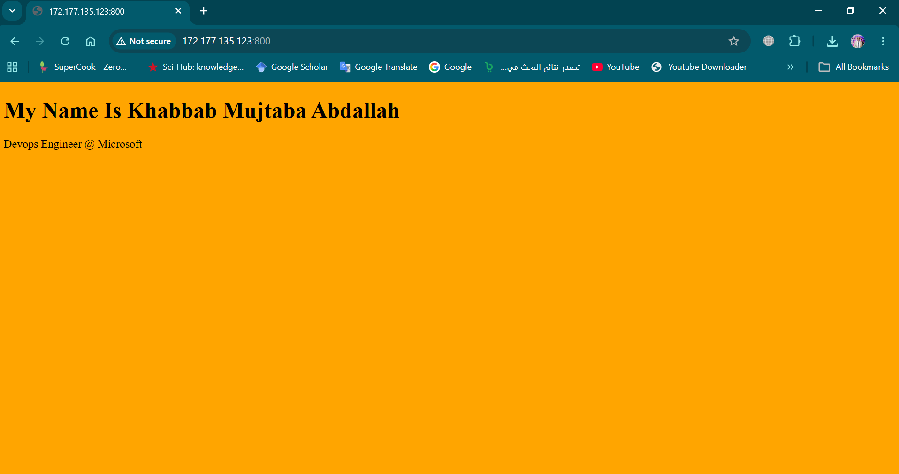

# Azure IIS Web Hosting Lab

Hands-on Microsoft Azure lab focused on deploying and managing a Windows Server virtual machine, configuring networking and security settings, installing IIS, and hosting a website.

---

## Technologies Used

* Microsoft Azure
* Windows Server
* IIS Web Server
* Azure NSG (Network Security Groups)
* Remote Desktop Protocol (RDP)
* HTML/CSS
* Networking Fundamentals

---

## Lab Tasks

* Created a Windows Server VM in Azure
* Configured inbound NSG rules
* Connected using Remote Desktop (RDP)
* Installed and configured IIS Web Server
* Hosted a custom website
* Configured firewall and HTTP access
* Tested website accessibility from browser

---

## Screenshots

### Azure VM Overview

### IIS Configuration

### NSG Rules

### Website Running

---

## Author

Khabbab Mujtaba Abdallah
IT Support Engineer | Azure | Networking | Cloud & DevOps
